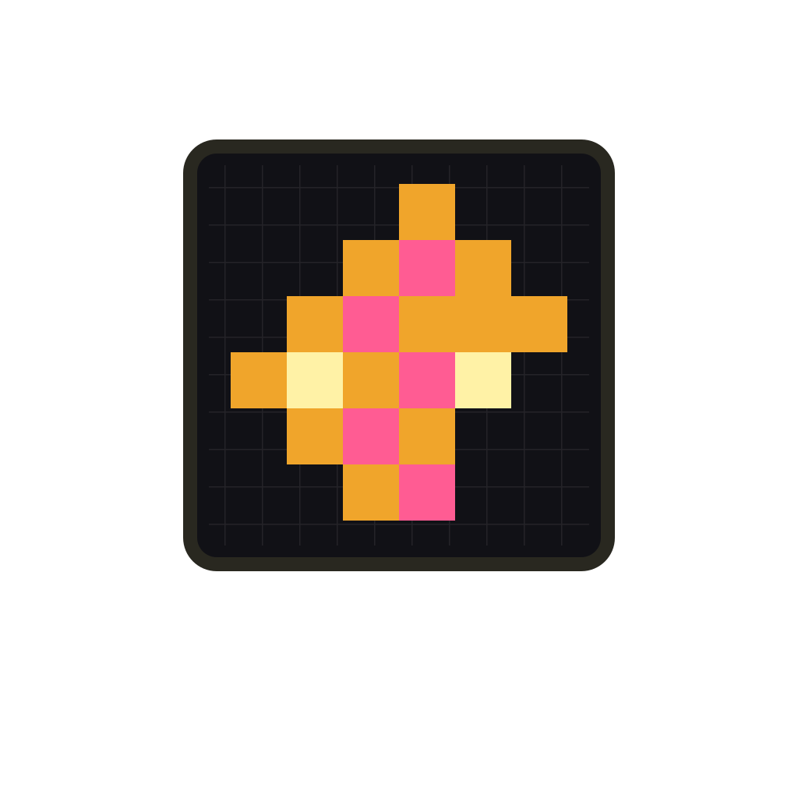
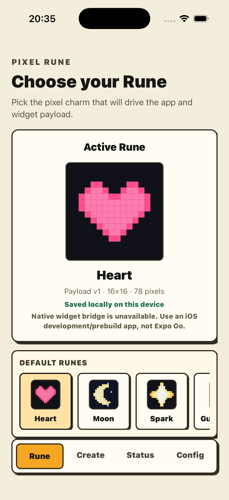
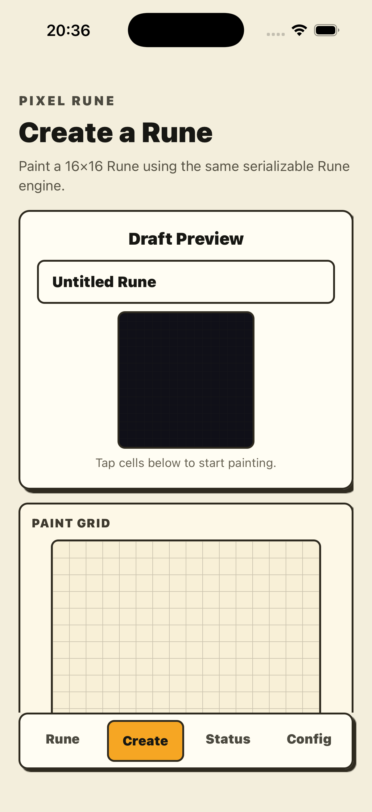

  

<h1 align="center">Pixel Rune</h1>

  Create, choose, and keep small pixel-art charms close at hand.

---

The app lets users pick a built-in Rune or paint their own, then save the active Rune locally so it can drive the in-app preview and the iOS widget payload.

## Product preview

| Choose a Rune | Create a Rune |
| --- | --- |
|  |  |

## What the app does

- Browse a default collection of pixel-art Runes.
- Select one active Rune and keep it saved locally on the device.
- Preview the selected Rune in the app.
- Paint a custom 16×16 Rune with a simple grid editor.
- Store Rune data in a serializable payload designed to be shared with a native iOS WidgetKit widget.
- Keep basic app readiness diagnostics available without interrupting the main Rune flow.

## iOS widget direction

Pixel Rune is designed around a conservative WidgetKit model:

- live interaction and motion belong inside the app;
- the home screen widget displays the selected Rune from shared local state;
- widget refresh timing follows iOS WidgetKit limits.

This keeps the product aligned with App Store expectations and avoids promising real-time widget behavior that iOS does not guarantee.

## Current status

The current build demonstrates the core Rune loop:

1. choose a built-in Rune;
2. preview it in the app;
3. save the selected Rune locally;
4. prepare the selected Rune payload for native widget sync;
5. create custom Runes from a 16×16 editor.

Native WidgetKit support requires an iOS development/prebuild build or EAS build. Expo Go can display the app screens, but it cannot include the custom native widget bridge.

## Store positioning

Pixel Rune should be presented as a polished personalization app:

> Create and collect tiny pixel-art Runes, choose the one that matches your mood, and keep it visible through an iPhone home screen widget.

The first App Store submission should focus on the local Rune and widget experience before adding accounts, sharing, premium packs, or subscriptions.

## Platform

- iOS and Android mobile app built with Expo and React Native.
- Native iOS WidgetKit extension planned for the iPhone widget experience.
- Backend, analytics, purchases, and crash reporting integrations are prepared for later product slices.
